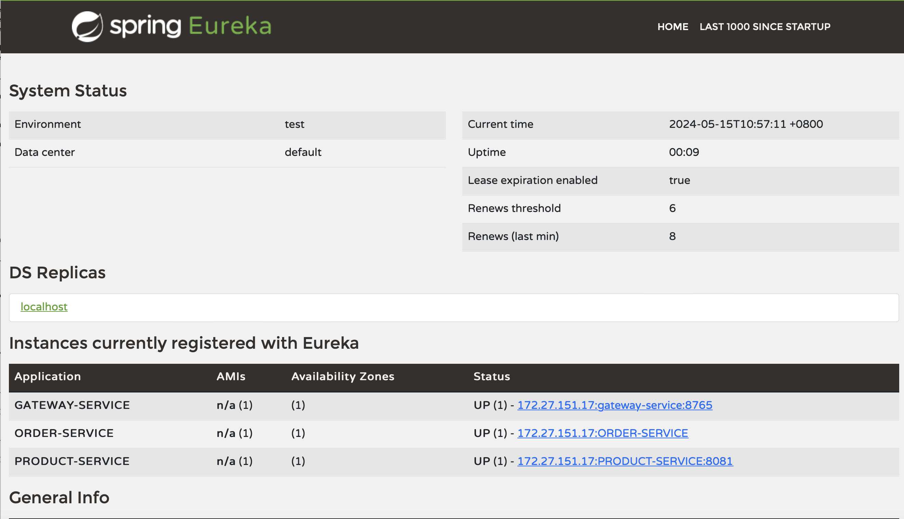

将service分成order-service、product-service、gateway-service、discovery-service四个部分运行。

其中：
- discovery-service：Eureka 服务器，服务注册与发现
- gateway-service：API 网关，统一管理和路由
- product-service：用于处理与产品有关的服务
- order-service：用于处理与其他信息有关的服务

如下图所示。

此时即可通过http://localhost:8765+API访问具体服务。

在ubuntu20.04下，使用docker容器，对每个服务分配1个cpu，进行水平拓展测试。

对product-service进行实验。实验结果如下：

| 节点个数 | Avg(ms) | Min(ms) | Max(ms) | 
| -------- | ------- | ------- | ------- | 
| 1        | 1590    | 825     | 2632    | 
| 2        | 312     | 11       | 961    | 
| 3        | 241     | 6      | 513     | 

